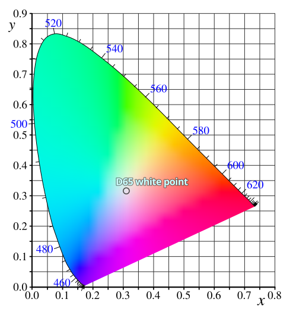
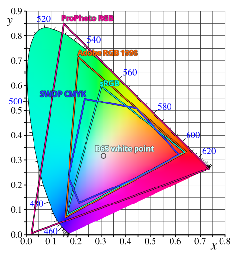

## CIE
`CIE` - Международная Комиссия по Освещению (на французком). Она занимается
стандартизацией диаграмм цвета и светотехникой в целом. Ее диаграммы описывают
весь спектр цветов (оттенков, насыщеностей и яркостей), которые видит человек.
Некоторые ее диаграммы удобны для представления цветов человеком: `CIE xy`,
`CIE xyY`. Некоторые диаграммы используются внутри цифровых пространств для
математических вычислений: `CIE XYZ`, `CIELAB`.


## CIE xy
<p align="center">
  
</p>

`CIE XY` - двухмерная диаграмма, которая показывает все цвета видимые для человека.
Она показывает только цветность (разные цвета с переменной насыщеностью (saturation) и
фиксированной светлостью/яркостью (lightness/brightness)).

Состав диаграмы:
- По контору диаграммы отображаются насыщенные цвета и их длины волн. Например:
    - Красный ≈ 700нм
    - Зеленый ≈ 520нм
    - Фиолетовый ≈ 380нм
- В центре (по координатам ≈ (0.3127, 0.3290)) находится точка D65 с нуливой насыщеностью.
Ее называют "белой точкой", хотя в зависимости от фиксированной яркости она может
быть и белой, и черной, и серой;
- Внутри диаграмы показываются цвета смешения. Например при смешении фиолетового и
красного, мы получим по координатам ≈ (0.45, 0.15) пурпурный цвет.

Забавный факт: Из диаграммы видно, что не существует длины волны, которая показывает
розовые / пурпурные цвета, но наш глаз видит такие цвета при смешении света.


## CIE xyY
Диаграмма `CIE xyY` является продолжением `CIE xy`. Она добавляет третью ось Y - яркость.
Предстваьте что к диаграмме `CIE xy` добавили еще одну полностью перпендикулярную
ось и растянули тукущую 2х мерную подково-видную диаграмму (`CIE xy`) по этой оси,
чтобы получилась 3х мерная форма.

Диаграммы `CIE xy` и `CIE xyY` удобны для связи x,y(,Y) с цветностью(цветом) для
человека, но редко используется для цифровой работы с цветом.

## Другие CIE диаграммы
В компьютерном пространстве, при интерпретации цвета в изображениях и видео в основном
используются `CIE XYZ` и `CIELAB` ([wiki](https://en.wikipedia.org/wiki/CIELAB_color_space)).


## Человеческий глаз
Человек воспринимает цвета по средством колбочек и палочки, находящихся внутри глаз.
Колбочки отвечают за восприятие цвета, палочки за восприятие яркости. В глазу есть
три вида колбочек. Каждый вид более восприимчив к разным длинам волны света: коротким,
средним и длинным волнам света. Свет с короткой длиной волны - синий, со средней длиной
волны - зеленый и с большой длиной волны - красный. Соответственно также называются
колбочки: S(short)-Колбочки, M(medium)-Колбочки, L(long)-Колбочки. Например, если человек
смотрит на зеленый свет, то сильнее всего стимулируются M-колбочки, а если смотрит
на желтый, то S-колбочки и L-колбочки стимулируются приблизительно одинаково.
Таким образом при использовании синего, зеленого и красного цвета можно "симулировать"
любой цвет воспринимаймый человеком, стимулируя соответствующие колбочки.

Забавный факт: Кошки также как и собаки являются дихотоматоми, т.е. они имеют только
2 типа колбочек. Из-за чего они видят синие и зеленые цвета, но красные или оранжевые
цвета не видят совсем (скорее всего видят как серые или желтые цвета). Также как и
люди не видят инфракрасный цвет (за красным) или ультрафиолет (за фиолетовым). Но
отсутствие одного вида колбочек восполняется большим количеством палочек из-за чего
они более восприимчивы к слабому освещению и следовательно лучше видят в темноте.


## Использование RGB цветов (Аддитивное смешение)
В связи с особенностями человеческого глаза, цветовые пространства часто используют
красный, зеленый и синий (RGB) цвета как базовые цвета. Эти цвета смешивают в разных
пропорциях, добавляя один цвет к другому, для получения необходимого цвета. Такое
добавление, работающее как свечение разными цветными фонариками, называется
аддитивным, потому что света не убывает, а добавляется при добавлении фонарика.
Если сразу добавить красный, зеленый и синий цвета, то итоговый цвет будет
приближаться к белому.


## Использование CMYK цветов (Субтрактивное смешение)
Другой способ формирования цвета который используется - субтрактивный. Это способ
формирования не добавлением цвета, а убиранием цвета от белого. Пример из реальной
жизни - рисование на белом листе бумаги. Если изначально белый лист отражает все цвета
и выглядит белым, то после добавления краски, какие-то цвета перестают отражаться и
поглащаются краской. Например при добавлении на белый лист голубой краски, эта краска
поглащает длинные световые волны (т.е. красные цвета), но средние и короткие отражает,
так что мы видим голубой цвет. При добавлении разных красок цвет будет стремиться к темному.
При субтрактивном формировании цвета используются цвета-антиподы RGB, а именно голубой,
пурпурный и желтый с добавлением черного (cyan, magenta, yellow and key (CMYK)). Этот
способ формирования цвета используется в печатной промышленности, где наносят краску
на различные поверхности.

*Зачем использовать дополнительный черный цвет, если его можно достичь при помощи
смешения трех других цветов?*  
1. Такое смешение потребует в 3 раза больше краски, чем просто добавление черной краски.
2. Такое смешение не стабильное. Т.е. может получаться не черный цвет, а грязно коричнивый.

*Почему не исользовать `sRGB` для цветной печати?*  
Можно, но для примера зеленый убирает больше света чем например голубой. Голубой
убирает только длинные световые волны, в то время как зеленый убирает и длинные и
короткие световые волны. Таким образом цветовой охват от смешения красок будет меньше.


## Цветовая модель
Цветовая модель это базовые цвета и способ смешивания. Примеры:
- RGB - красный, зеленый, синий + аддитивный способ смешивания;
- CMYK - голубой, пурпурный, желтый, черный + субтрактивный способ смешивания;
- Grayscale - серый. Нет способа смешивания. Все цвета на одной шкале (черный <-> белый)


## Цветовые пространства
Цветовое пространство - способ представления цвета при помощи записи в виде чисел.
Например, в цветовой модели RGB числа (0, 255, 0) должны обозначать "зеленый" цвет,
но какой конкретно зеленый цвет зависит от используемого цветового пространства.
Например при использовании `sRGB` (standard RGB) это будет обычный зеленый цвет, который
отображается на любом современном мониторе, а при использовании Adobe RGB, это будет
цвет намного насыщеней чем у sRGB, но отображающийся не на всех мониторах.

Пример применение цветовых пространств:
- `sRGB` - Компьютерные мониторы, web пространство;
- `CMYK` - Бытовая печать и полиграфия;
- `DCI-P3` - Цифровые кинотеатры;
- `Display P3` - HDR телевизоры;
- `Adobe RGB` - Профессиональная фотография и печать.

Основные компоненты составляющие цветовое пространство:
1. Цветовая модель (`RGB`, `CMYK`, `Grayscale`);
2. Цветовой охват, определенный при помощи базовых точек (пр. красной, зеленой и синей для RGB модели);
3. Белая точка (в разных пространствах белый может выглядеть по разному, например
  точка D65 или D63).

Перевод между цветовыми пространствами:  
Из-за разных цветовых охватов (гамм), при переводе между цветовыми пространствами
возникают сложности. Например, при переводе изображения из `sRGB` в `CMYK`, в последнем
может не оказаться насыщеных зеленых или оранжево-карсных цветов, а при переводе
обратно из `CMYK` в `sRGB`, может не оказаться светлоголубых или светложелтых оттенков.

Даже сами по себе цветовые охваты `CMYK` пространств могут сильно различается в зависимости
от принтеров. Из-за таких сложностей, редактор изображений `Krita`, рекомендует использовать
для работы широкие RGB пространства (например `Adobe RGB` или `ProPhoto RGB`) для
работы над изображением, а позже вручную переводить в необходимое для печати
`CMYK` пространства.


## Цветовые пространства на CIE xy
На диаграмме `CIE xy` часто показывают и сравнивают палитры цветовых пространств.
Ниже представлены сравнение гамм у разных цветовых пространствах. Само изображение
находится в sRGB цветовом пространстве, так что даже при использовании монитора,
который отображает более широкую гамму (пр. `Adobe RGB`), цвета не будут
представлены достоверно.

<p align="center">
  
</p>


## Цветовые пространства в изображениях
В файлах изображения используется или тег цветового пространства, или `ICC` профиль:
- Тег - символьное наименование цветового пространства. Устаревший способ и работает
  корректно только с `sRGB` (так как у него есть ICC профиль по умолчанию);
- `ICC` профиль - встраеваемый файл в файл изображения, который предоставляет
  математическую модель, переводящую данные цвета из изображения в `CIE XYZ`.
  Т.е. переводит цвета из внутренних значений изображения в незовисимый от
  цветового пространства вид.


`sRGB` (standard RGB) - одно из самых распространенных цветовых пространств для устройств с
экранами. sRGB имеет ICC профиль по умолчанию. Т.е. когда нет встроенного в файл
ICC профиля, то берется стандартный профиль по умолчанию. Название стандартного профиля -
`sRGB IEC 61966-2.1`.


`CMYK` - цветовое пространство используемое во время цветной печати. Из-за сложности
печати на бумаге, CMYK часто не может воспроизвести одновременно яркие и насыщенные
цвета. Профиля по умолчанию этого цветового пространства не существует и для работы с
ним нужно получить ICC профиль для конкретного устройства печати.


## Цветовые пространства в Видео
В видео не используются отдельные цветовые профили, а используются комплексные
видеостандарты: `BT.601`, `BT.709`, `BT.2020`. Эти стандарты определяют цветовые
пространства, разрешения, частоты кадров, диапазон яркости и тд.

| Параметр | ITU-R BT.601 | ITU-R BT.709 | ITU-R BT.2020 |
| - | - | - | - |
| Цветовое пространство | Rec.601 | Rec.709 | Rec.2020 |
| Разрешения  | 720x480 | 1920x1080, 1920x1080 | 3840x2160, 7680x4320 |
| Частоты кадров | 23.976, 24, 25, 29.97, 30 | 23.976, 24, 25, 29.97, 30, **50**, **60**, | 23.976, 24, 25, 29.97, 30, 50, 60 **100**, **120**, |
| Диапазон яркости | SDR | SDR | HDR |
| Глубина цвета (бит на канал) | 8 | 8 | 10, 12 |
| Основные кодеки | MPEG-2, DivX, XviD | H.264/AVC, MPEG-2 | H.265/HEVC, AV1, VVC |

Также есть `ITU-R BT.2100` - Стандарт-надстройка над `ITU-R BT.2020`, которая вводит новые
способы кодирования HDR.

### HDR
`HDR` (High Dynamic Range) - современная технология спецификация которая сильно расширяет
яркость изображений и видео. Яркость определена в абсолютных значениях, а не в относительных,
как в sRGB.

### SDR
`SDR` (Standard Dynamic Range) - стандарт определяющий работу с яркостью в изображениях и
видео. Он основывается на работе яркости в `sRGB`. Также как и `sRGB` он задает относительные
велечины яркости.


## Цветовые пространства у устройств
- `sRGB` - Пространство отображаемое большинством устройств бюджетного и среднего
  класса (мониторов, телефонов, ноутбуков, телевизоров). `sRGB` является
  стандартом для веба и для не профессионального контента.
- `DCI-P3` - Пространство стандартное для кинопроекторов.
- `Display P3` - Пространство созданное Apple для своих устройств (iPhone, iPad,
  ...) основонное на `DCI-P3` (кинопроекторный стандарт).
- `Adobe RGB` - Пространство используемое мониторами созданными для фотографов,
  дизайнеров и полиграфии.

При отображении изображений или воспроизведении видео происходит следующее
преобразование:  
```
Цветовое пространство источника (изображени, видео) -> CIE XYZ -> Цветовое пространство монитора
```
Современные и дорогие мониторы часто имеют охват:
- 90-95% `DCI-P3`
- и
- 70-80% `Rec.2020`

В связи с чем цветовой охват изображения или видео автоматически преобразуется в
физический охват конкретного монитора.

## Резюме по цветовым пространствам
- `sRGB`, `Adobe RGB`, `CMYK` - Цветовые пространства для кодирования изображений
- `sRGB`, `Adobe RGB`, `Display P3`, `DCI-P3` - Цветовые пространства для
  отображения устройствами
- `BT.601`, `BT.709`, `BT.2020` - Стандарты для кодирования видео с цветовыми
  пространствами `Rec.601`, `Rec.709`, `Rec.2010` соответственно.


## Желтый при черное-белой печати?!
Когда-нибудь задумывались почему при попытке напечатать черно-белый документ принтер
сообщает "недостаточно желтого"? Почему вообще используется желтый а не черный?

Дело в том, что перед печатью, документ (его изображение) должен быть преобразован в
соответсвующее цветовое пространство CMYK принтера. Преобразование происходит автоматически и
черный в итоге может быть получен разными способами:
- при помощи только черной краски;
- при помощи смешения голубово, пурпурного и желтого в равных пропорциях;
- при помощи и черной, и остальных красок.

Такая ситуация может быть не самой предпочтительной при профессиональной печати или
для обычного человека (в целях экономии краски). В этом случае можно самостоятельно
преобразовать изображение в соответсвующее цветовое пространство для принтера и задать
сочетание цветов и использование краски.

Заметка: Драйвера некоторых принтеров позволяют задать "Только черная краска".  
Заметка: При использовании не только черной краски часто можно получить более глубокий черный.
