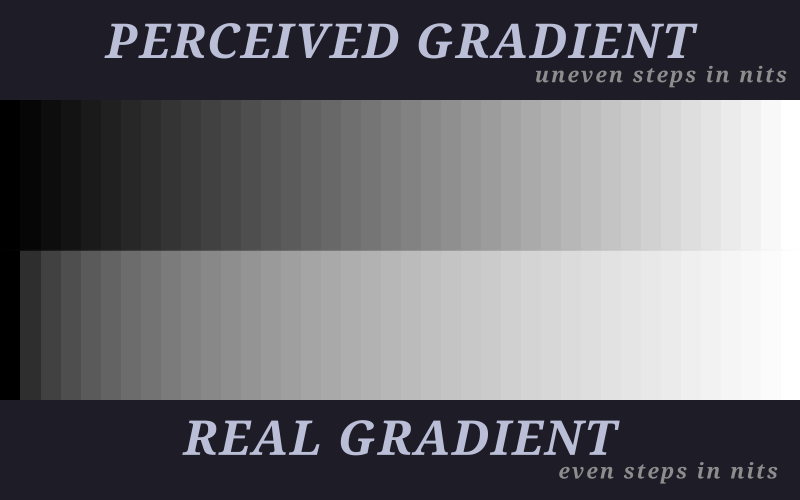

# Basic information

To compare the image formats we should know some things beforehand. Some of
them are:

- **Lossy compressions:**  
Every time a lossy format compresses an image it loses some information and
each subsequent recompression results in further data degradation.

- **Lossless compressions:**  
Lossless compressions don't lose any information when compressed and every
subsequent recompression doesn't result in any data loss.

- **Color model:**  
There are different color models to digitally represent colors. Models define
base attributes like:
- `rgb` - red, green and blue
  - `rgb(255, 255, 0)` - yellow
- `cmyk` - cyan, magenta, yellow and key (black)
  - `cmyk(0%, 100%, 0%, 0%)` - magenta
- `lab` - lightness and a, b
  - `lab(55, 80, 70)` - red

- **Channels:**  
A channel is a layer that contains all values of one base attribute of an
image. For example, we can represent an `rgb` image as three images with red,
green and blue components. Every such "image" is a channel.

- **Alpha channel:**  
Alpha channel is a channel that represents the transparent part of an image.
Images without alpha channels are completely opaque. Color models are often
called with `a` at the end if they have alpha channel: `rgba`, `cmyka`, `laba`

- **Bits per channel:**  
Every encoded image has fixed amount of bits per channel. For example, an
`rgb` image with 8 bits per channel means that there are 8 bits per `red`,
`green`, and `blue` allowing for a total of 2^24 possible colors per pixel.

- **Brightness/lightness:**  
Brightness and lightness in terms of image formats is the same thing. It might
be encoded in color channels like with `rgb` and it might be a separate
channel like `l` in `lab`. We can calculate the brightness of a pixel in `rgb`
model approximately by the formula `Y ≈ 0.2r + 0.7g + 0.1b`.

- **SDR and HDR:**  
`SDR` and `HDR` are technologies that provide a way to store a wider range of
brightness levels that match the perception of the human eye in image and
video formats. The thing is that humans distinguish shadows better than light
shades.

<p align="center">
  
</p>

```
A nit is a unit of measurement for the luminance (brightness) of a screen
```

- **SDR:**  
`SDR` (Standard Dynamic Range) is a collection of standards for more efficient
storage of brightness. The term itself was introduced to distinguish it from
`HDR` in the 2010s. It's been used since the 1950s and it uses a gamma
function to encode and decode brightness. The real gamma functions are similar
to these:
  - `y' = y ^ (1/2.2)` - to encode brightness
  - `y = y' ^ 2.2` - to decode brightness

- **HDR:**  
`HDR` (High Dynamic Range) is a modern technique to store brightness in files.
It uses complex functions to encode and decode brightness that consist of
different pieces. In modern days, the device or monitor should support HDR to
be able to display it.

# Legacy raster formats
The formats in this section are a bit outdated and aren't recommended for use
today except for backward compatibility. The industry was inexperienced at the
time of developing the formats and some features that are now considered
fundamental weren't implemented at the time.

### Comparison:

|  | Release | Type | Bits per channel | Animation | Transparency |
| -: | :-: | :- | :-: | :-: | :-: |
| `GIF` | 1987 | lossless | 8*¹ | ✅ | ✅*² |
| `JPEG` | 1992 | lossy | 8*³ | ❌ | ❌ |
| `PNG` | 1996 | lossless | 8*³ | ❌ | ✅ |

- ¹ - Despite having 24 bits for a color, it has only a 256-color palette.
- ² - One color can be marked as transparent. It means it doesn't support
  partial transparency.
- ³ - `JPEG` and `PNG` have 16-bit-per-channel subformats, but they aren't
  universally supported.

### Origins:
- `GIF` is one of the first widespread formats for the web. It was developed
using a proprietary compression algorithm. Due to this, the format didn't
evolve much. The patents relating to the compression expired in 2004.

- `JPEG` was developed for photos and it loses data in a specific way so it
wouldn't be very noticeable for the human eye.

- `PNG` was developed as an improved and free replacement for `GIF`. Despite
being a replacement for `GIF`, it didn't have animation support at first.
Further attempts to add animation support weren't very successful. `MNG` format
had very complex design and didn't have backward compatibility with `PNG`.
Standardization of `APNG` was late and irrelevant by that time.


# Modern raster formats

Unlike legacy formats, all modern formats that are described here have these
features:
- Alpha channel - The formats can contain a partially or fully transparent image.
- Lossless and lossy modes - So the user might choose how to encode an image.

### Comparison:

|  | Release | Animation | HDR | Bits per channel |
| - | - | - | - | - |
| `WebP` | 2010 | ✅ | ❌ | 8 |
| `HEIC` | 2013 | ⚠️*¹ | ✅ | 8, 10 |
| `AVIF` | 2019 | ✅ | ✅ | 8, 10, 12 |
| `JPEG XL` | 2021 | ✅ | ✅ | 8, 10, 12, 16, 32 |
- ¹ - Despite having the animation support, it's rarely used and programs often
  don't support it.

### Origins:
- `WebP` is an open format developed by Google. It is the first format that
succeeded in replacing legacy formats (`GIF`, `JPEG` and `PNG`). It's widely
used and supported, but now slowly falls back to more modern formats like `AVIF`.

- `HEIC` is a format that was developed by `MPEG`. It uses non royalty-free `HEVC`
compression algorithm. Software developers and device manufacturers must consider
licensing contributions to use the format. It was mostly popularized by Apple
and is used in its ecosystem. It has limited support outside of the Apple.

- `AVIF` is a free and open image file format. It isn't ubiquitously supported
yet but tends to become so.

- `JPEG XL` is a free and open file format. A variety of companies have
publicly voiced support for it as their preferred choice. Though Google
introduced support of the format in 2021 and then dropped it in 2022. The main
critique is that it doesn't introduce much in terms of compression or features
in comparison to the existing `AVIF` format. Another critique is that the main
implementation is based on `C++` (as opposed to other formats in `C`) and it
increases maintenance burden, particularly for security auditing. Despite all
of that it has all modern features (up to the time of writing) and might
become a mainstream format for professionals as an alternative to `PSD` or
`TIFF`.


# A quick peek at professional raster formats

- `PSD` is a format that is used to store Photoshop projects. It is de facto
the mainstream format in image editing. While Adobe has published some
documentation for the format, it's not a complete, open or up-to-date
standard. In practice, software developers must still rely on reverse
engineering to implement the format, which leads to average portability across
different programs.

- `TIFF` was developed as a proprietary format but now it's free and open. It
has bad support by programs because it's very broad, making it hard to
implement fully.

`JPEG XL` would be a good alternative to `PSD` and `TIFF` as a portable,
well-documented format with layers, though it's dubious that the main
companies like Adobe would adopt the format as they already have their own
proprietary alternatives.


# Helpful references

> ⚠️  The following table is inaccurate (though useful):  

[Table with all image formats](https://socialcompare.com/en/comparison/image-file-formats)
