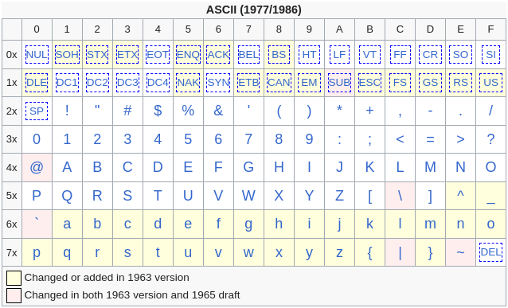
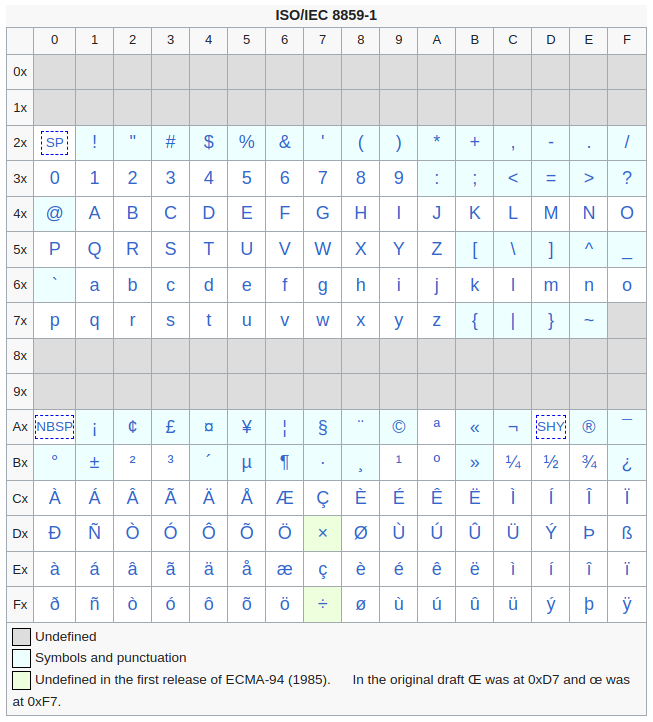
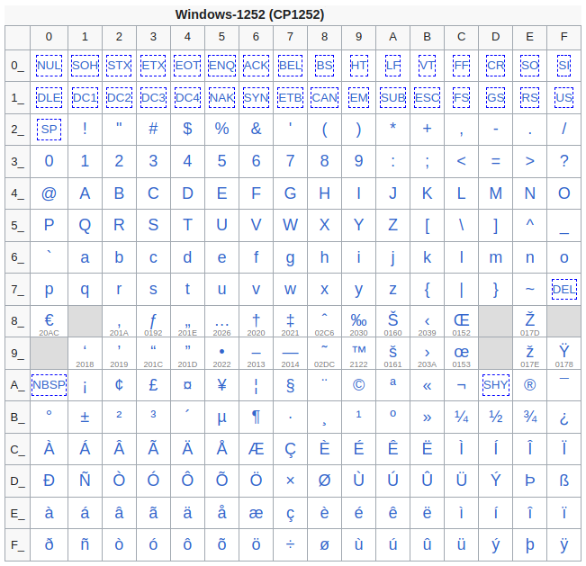

# Character encodings
A character encoding is the process of assigning numbers to characters that
allows them to be stored, transmitted and transformed using computers.

## Terminology
**A grapheme** is a unit of a writing system that is recognized as a single
element:
- "a" and "A" are the same grapheme.

**A glyph** is an image that represents a grapheme:
- "a" and "A" are different glyphs.

**A character** - A minimal unit of information that roughly corresponds to a
grapheme:
- `a`, `й`, `👍`, `💻`

 

**A control character** - A number that doesn't represent a written character
and is used to control peripheral devices or provide meta-information:
- `tab`, `backspace`, `delete`, `null`, `escape`

 

**A character set** - A collection of characters used to represent text, like
**latin alphabet** or **greek alphabet**:
- `abcde..zABCDE..Z`
- `абвгд..яАБВГД..Я`

 

**A coded character set (code page / charmap)** - A character set mapped to a
set of unique numbers:

Number  | Character
--      | --
0       | `null`
1       | a
2       | b
..      | ..
26      | z

 

**A character repertoire** - A character set that can be represented by a
particular coded character set:
- `abcd..z` and `null`
> This is the repertoire of the coded character set above.
 

**A code point** - A number or position of a character in a coded character set:
- `0` for `null`
- `26` for `a`
> These are code points from the coded character set above.

 

**A code unit** - A minimum bit combination that can represent a code point in
a character encoding:
- `7 bits` for `ASCII`
- `8 bits` for `UTF-8`
- `32 bits` for `UTF-32`

## ASCII
**ASCII** (American Standard Code For Information Interchange) is one of the first
widely recognized character encoding standard. It was developed in the early
1960s. `ASCII` uses 7 bits to represent characters, allowing 128 unique
characters. Nowadays, `ASCII` characters stored in bytes (octets) with the first
bit set to zero.

  

### Control characters
`ASCII` uses the first 32 code points and the last one for control characters.
They are intended to control perepheral devices (such as printers) and carry
meta-information about the data streams.

Some of the most prominent control characters:
Name             | Abbreviation | Number | Description
--               | --           | --     | --
`Null`           | NUL          | 0      | Is used as a string terminator in `C`.
`Backspace`      | BS           | 8      | Removes the previous character.
`Horizontal tab` | HT           | 9      | Makes a tabulation.
`Line feed`      | LF           | 10     | Makes a new line.
`Escape`         | ESC          | 27     | Invokes alternative interpretation on the following characters.
`Delete`         | DEL          | 127    | Removes the next character.

## ISO/IEC 8859
**ISO/IEC 8859** is a series of standards for 8-bit character encodings. The
series of standards consists of 15 numbered parts, such as `ISO/IEC 8859-1`,
`ISO/IEC 8859-2`, etc. It's mostly been replaced by Unicode and `UTF-8`.

  

**ASCII relations**:
- `ISO/IEC 8859` reuses the 95 of the printable `ASCII` characters:
  - `0x20 - 0x7E`
- `ISO/IEC 8859` doesn't assign any meaning to the `ASCII` control characters:
  - `0x00 - 0x1F`, `0x7F`

The common structure of the coded character sets:
Range | ISO-8559
-- | :--:
`0x00-0x1F` | *
`0x20-0x7E` | `ASCII` characters
`0x7F-0x9F` | *
`0xA0-0xFF` | Standard part specific characters
> `*` - No characters are assigned to these areas. The code points are left for
> control characters.

Some standard parts:
- `ISO-8559-1` - Most widely used standard, covering most **Western European
  languages**.
- `ISO-8559-3` - covers **Turkish, Maltese, and Esperanto** characters.
- `ISO-8559-5` - Covers **Slavic languages** that use a Cyrillic alphabet.
- `ISO-8559-6` - Covers **Arabic language** characters.
- ....

## Windows-125x series
**Windows-125x** are 9 encodings that use single-byte character set. They extend
`ASCII` encoding. It's mostly been replaced by Unicode and `UTF-8`.

  

Standard id | Covers languages | Similarity to `ISO-8859`
--          | --               | --
1250        | Central European | Similar to `ISO-8859-2`
1251        | Cyrillic         | -
1252        | Western European | Superset of `ISO-8859-1`
1253        | Greek            | Similar to `ISO-8859-7`
1254        | Turkish          | Superset of `ISO-8859-9`
1255        | Hebrew           | Almost a superset of `ISO-8859-8`
1256        | Arabic           | -
1257        | Baltic           | Similar to `ISO-8859-13`
1258        | Vietnamese       | -

## Unicode
**Unicode** isn't an encoding on its own. It's a universally used standard that
provides a coded character set. It doesn't represent characters in numeric form
for storing, transmission and transformation, though it provides some standard
encodings:
`UTF-8`, `UTF-16` and `UTF-32`.

Example:

<table>
  <tr>
    <th rowspan=2>Unicode code points</th>
    <th colspan=3>Unicode encoding representations</th>
  </tr>
  <tr>
    <th>UTF-8</th>
    <th>UTF-16</th>
    <th>UTF-32</th>
  </tr>
  <tr>
    <td style="text-align: center">U+0061 (a)</td>
    <td>61</td>
    <td>00 61</td>
    <td>00 00 00 61</td>
  </tr>
  <tr>
    <td style="text-align: center">U+0429 (Щ)</td>
    <td>D0 A9</td>
    <td>04 29</td>
    <td>00 00 04 29</td>
  </tr>
  <tr>
    <td style="text-align: center">U+1F4A9 (💩)</td>
    <td>F0 9F 92 A9</td>
    <td>D8 3D DC A9</td>
    <td>00 01 F4 A9</td>
  </tr>
  <tr>
    <td style="text-align: center">U+1F605 (😅)</td>
    <td>F0 9F 98 85</td>
    <td>D8 3D DE 05</td>
    <td>00 01 F6 05</td>
  </tr>
</table>

## UTF-8
**UTF-8** is a variable length character encoding standard. It is used for
Unicode text stream storage and exchange. It's widely used and implemented in
all modern operating systems.

### Main ponits
- It's capable of encoding all 1,112,064 Unicode code points using one to four
  bytes.
- Its backward compatible with `ASCII`. It means any `ASCII` text stream is a
  valid `UTF-8` encoded stream.
- Code points with lower numerical values, which tend to occur more frequently,
  are encoded using fewer bytes.
- It's self-synchronizing, meaning that it's possible to identify the start of
  a character by examining at most four bytes.
- It's not endian dependent because it uses sequences of bytes.

> Main disadvantage: The Nth character of a data stream can't be accessed
> directly by index because of the varying character byte size.

`UTF-8` might use `BOM` (`U+FEFF`) character to signal that the `UTF-8`
encoding is used, but the standard doesn't recommend to do so due to
compatibility issues with `ASCII`.

### Encoding
Code point range      | Byte 1   | Byte 2   | Byte 3   | Byte 4
--                    | --       | --       | --       | --
`U+0000 - U+007F`     | 0xxxxxxx | -        | -        | -
`U+0080 - U+07FF`     | 110xxxxx | 10xxxxxx | -        | -
`U+0800 - U+FFFF`     | 1110xxxx | 10xxxxxx | 10xxxxxx | -
`U+100000 - U+10FFFF` | 11110xxx | 10xxxxxx | 10xxxxxx | 10xxxxxx

## UTF-16
**UTF-16** is a character encoding standard that is used for storage and
exchange of Unicode text stream. It uses 2 or 4 bytes to represent a Unicode
code point.

Main points:
- It's capable of encoding all 1,112,064 Unicode code points using one to four
  bytes.
- Its backward compatible with `UCS-2`. It means any `UCS-2` text stream is a
  valid `UTF-16` encoded stream.
- The first 65536 code points (`BMP`) are encoded by only two bytes.
- It's self-synchronizing, meaning that it's possible to identify the start of
  a character by examining at most four bytes.

Disadvantages:
- It occupies more space than `UTF-8` for plain English text.
- It's endian dependent and has two variants `UTF-16BE` and `UTF-16LE`, though
  it might use `BOM` to signal the variant.
- The Nth character of a data stream can't be accessed directly by
  index because of the varying character byte size.

### Encoding
It uses two ways of representing code points:
Code point range     | Unicode range name               | `UTF-16` representation
--                   | --                               | --
`U+0000 - U+FFFF`    | Basic Multilingual Plane (`BMP`) | 2 bytes that directly convey a code point.
`U+10000 - U+10FFFF` | Supplementary planes             | 4 bytes that use surragte ranges.

Two surrogate (non-character) ranges for addressing purposes:
Code point range | Code point range | Count of code points | Purpose
--               | :--:             | :--:                 | --
High surrogate   | `U+D800-U+DBFF`  | 1024                 | **First** two bytes of a code point over `U+FFFF`.
Low surrogate    | `U+DC00-U+DFFF`  | 1024                 | **Second** two bytes of a code point over `U+FFFF`.

High and low surragate ranges allow to encode additional `1024 * 1024 =
1048576` codepoints outside of `BMP` code points.

Example:
Code point | Character | The first 2 bytes | The second 2 bytes
:--:       | :--:      | :--:              | :--:
`U+0041`   | `A`       | 0x0041            | -
`U+0401`   | `Ё`       | 0x0401            | -
`U+10000`  | `𐀀`       | 0xD800            | 0xDC00
`U+1F643`  | `🙃`      | 0xD83D            | 0xDE43

## UTF-32 (aka UCS-4)
**UTF-32** is a fixed-length encoding that is used to encode Unicode code
points. Each 32-bit value in `UTF-32` represents one Unicode code point. Due
to the size of Unicode code points, the first 11 bits of a `UTF-32` value are
always zero.

The advantages of `UTF-32` in comparison to `UTF-8` and `UTF-16` are not
significant, because even with the fixed length of code points representation,
combined character often should be taken into account.

Disadvantages:
- The size of an encoded string might be up to four times larger than in
  `UTF-8` and up to two times larger than `UTF-16`.
- It's endian dependent and has two variants `UTF-32BE` and `UTF-32LE`, though
  it might use `BOM` to signal about the variant.

Example:
Code point | Character | `UTF-32BE` representation
:--:       | :--:      | :--:
`U+0041`   | `A`       | 0x0000 0x0041
`U+1F643`  | `🙃`      | 0x0001 0xF643

## Other encodings
- **UCS-2** is a fixed-length encoding that uses 2 bytes to represent Unicode
  code points. It's been superseded by `UTF-16` that allows to represent code
  points outside of `BMP` (65536 characters).

- **GB 18030** is a Chinese government standard for Unicode code points
  representation. It's a variable-length encoding scheme. A portion of
  the standard is required to implement for all software products sold in
  China.

- **Shift_JIS** is a character encoding for the Japanese language. It's based on
  character sets defined within `JIS`. It's the second-most declared character
  encoding for Japanese websites after `UTF-8`.

## Obsolete encodings
- **KOI-8** is an 8-bit extension of `ASCII`. It included 32 lowercase and 31
  uppercase Russian letters.

- **Big5** is a Chinese character encoding used in Taiwan, Hong Kong, and Macau
  for traditional Chinese characters. The original `Big5` character set is
  sorted first by usage ferquency, second by stroke count, lastly by Kangxi
  radical.
